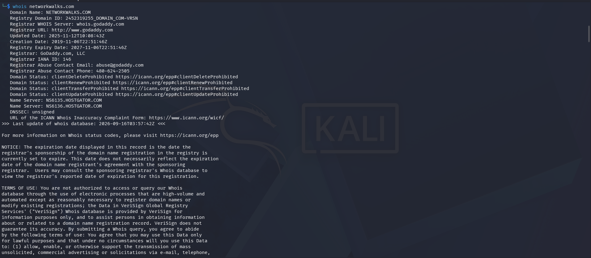
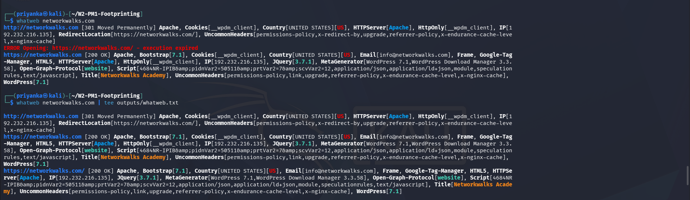
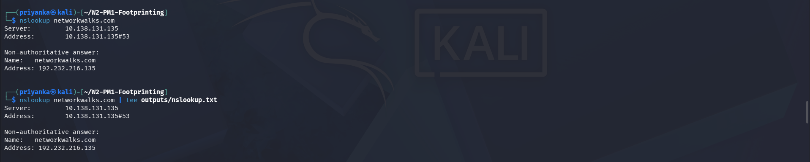
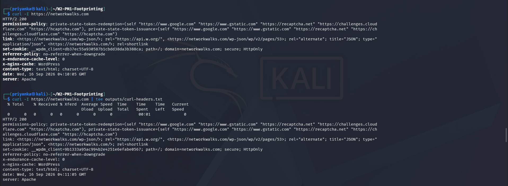
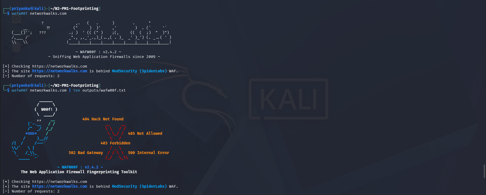
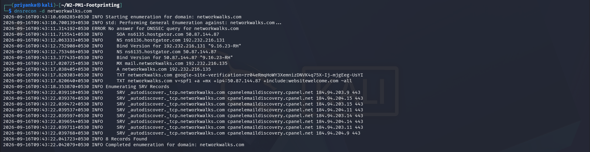

# W2-PM1: Footprinting and Reconnaissance

## Project Overview

This project documents a passive and low-impact reconnaissance exercise performed as part of the NetworkWalks cybersecurity practical assignment.

The objective was to collect publicly available information about the authorized target domain using multiple built-in Kali Linux reconnaissance tools.

## Target

- **Target Domain:** `networkwalks.com`
- **Assessment Type:** Footprinting and reconnaissance
- **Operating System:** Kali Linux
- **Tools Used:** WHOIS, WhatWeb, NSLookup, cURL, WAFW00F, DNSRecon

> This project is intended for educational purposes and was limited to the commands specified in the practical assignment. No exploitation, brute-force activity, vulnerability exploitation, or intrusive scanning was performed.

---

## Objectives

The objectives of this practical were to:

1. Collect domain registration and ownership metadata.
2. Identify publicly visible web technologies.
3. Resolve the target domain to its IPv4 address.
4. Inspect HTTP response headers.
5. Detect the presence of a Web Application Firewall.
6. Enumerate publicly available DNS records.

---

## Tools and Commands

### 1. WHOIS

**Purpose:** Collect domain registration information, registrar details, domain dates, name servers, and registration status.

```bash
whois networkwalks.com | tee outputs/whois.txt
```

### 2. WhatWeb

**Purpose:** Identify publicly exposed web technologies, server software, frameworks, CMS information, cookies, and redirects.

```bash
whatweb networkwalks.com | tee outputs/whatweb.txt
```

### 3. NSLookup

**Purpose:** Resolve the domain name and identify its IPv4 address.

```bash
nslookup networkwalks.com | tee outputs/nslookup.txt
```

### 4. cURL

**Purpose:** Retrieve HTTP response headers from the target website.

```bash
curl -I https://networkwalks.com | tee outputs/curl-headers.txt
```

### 5. WAFW00F

**Purpose:** Detect and fingerprint a possible Web Application Firewall.

```bash
wafw00f networkwalks.com | tee outputs/wafw00f.txt
```

### 6. DNSRecon

**Purpose:** Enumerate publicly available DNS records, including SOA, NS, A, MX, TXT, and SRV records.

```bash
dnsrecon -d networkwalks.com | tee outputs/dnsrecon.txt
```

---

## Findings Summary

| Tool | Main Observation |
|---|---|
| WHOIS | Domain registered through GoDaddy, with privacy protection enabled |
| WhatWeb | Apache, WordPress 7.1, WordPress Download Manager, jQuery, Bootstrap, and Google Tag Manager detected |
| NSLookup | `networkwalks.com` resolved to `192.232.216.135` |
| cURL | HTTPS returned `HTTP/2 200`; Apache server and WordPress-related headers were observed |
| WAFW00F | ModSecurity (SpiderLabs) WAF was detected |
| DNSRecon | SOA, NS, A, MX, TXT, and SRV records were identified |

---

## Detailed Findings

### WHOIS Findings

The WHOIS lookup identified:

- Registrar: GoDaddy.com, LLC
- Domain creation date: 2019-11-06
- Domain update date: 2025-11-12
- Registry expiry date: 2027-11-06
- Registration privacy service: Domains By Proxy, LLC
- Name servers:
  - `NS6135.HOSTGATOR.COM`
  - `NS6136.HOSTGATOR.COM`
  - `NS29.DOMAINCONTROL.COM`
  - `NS30.DOMAINCONTROL.COM`

The registrant information was privacy-protected.

### WhatWeb Findings

WhatWeb identified the following publicly visible technologies and characteristics:

- Apache web server
- WordPress 7.1
- WordPress Download Manager 3.3.58
- jQuery 3.7.1
- Bootstrap 7.1
- Google Tag Manager
- HTML5
- HTTPS redirection from HTTP (301 → 200)
- Website title: `Networkwalks Academy`
- Publicly detected IP address: `192.232.216.135`

Technology detection does not automatically indicate a vulnerability. It only identifies information exposed by the website.

### NSLookup Findings

The domain resolved to:

```text
networkwalks.com → 192.232.216.135
```

The response was non-authoritative and was received through the configured DNS resolver.

### cURL Header Findings

The HTTPS response returned:

```text
HTTP/2 200
server: Apache
content-type: text/html; charset=UTF-8
```

Other observed headers included:

- `permissions-policy`
- `referrer-policy`
- `x-endurance-cache-level`
- `x-nginx-cache`
- `link`
- `set-cookie`

The `Link` header exposed WordPress REST API-related paths, including `/wp-json/`.

The presence of a header or public endpoint does not by itself confirm a security weakness.

### WAFW00F Findings

WAFW00F reported:

```text
The site https://networkwalks.com is behind ModSecurity (SpiderLabs) WAF.
```

The tool used two requests for fingerprinting.

This indicates that the website is likely protected by ModSecurity. The result does not provide confirmation about the WAF's rule configuration, coverage, or effectiveness.

### DNSRecon Findings

DNSRecon identified the following records:

- SOA record: `ns6135.hostgator.com`
- NS record: `ns6135.hostgator.com`
- NS record: `ns6136.hostgator.com`
- A record: `192.232.216.135`
- MX record: `mail.networkwalks.com`
- TXT record containing Google site verification
- TXT record containing SPF configuration
- SRV records for email autodiscovery (8 records found)

The observed SPF record was:

```text
v=spf1 +a +mx +ip4:50.87.144.87 +include:websitewelcome.com ~all
```

DNSRecon also reported the DNS software version:

```text
9.16.23-RH
```

This was recorded as an observed information disclosure. It was not treated as proof of a vulnerability.

---

## Security Considerations

The reconnaissance results provide useful information for asset inventory and security assessment, including:

- Domain registration information
- Hosting and DNS infrastructure
- Web server and CMS technologies
- Public IP address
- Mail configuration
- WAF presence
- Public DNS service records

These observations should be reviewed by the system owner to ensure that only necessary information is publicly exposed and that software components are maintained and updated.

---

## Evidence

Command outputs are stored in the `outputs/` directory.

Screenshots of the terminal commands and results are stored in the `screenshots/` directory.

### Output Files

- `outputs/whois.txt`
- `outputs/whatweb.txt`
- `outputs/nslookup.txt`
- `outputs/curl-headers.txt`
- `outputs/wafw00f.txt`
- `outputs/dnsrecon.txt`

### Screenshots

- `screenshots/task0-environment-setup.png` — environment and tool verification
- `screenshots/task1-whois.png` — WHOIS lookup
- `screenshots/task2-whatweb.png` — WhatWeb scan
- `screenshots/task3-nslookup.png` — NSLookup resolution
- `screenshots/task4-curl.png` — cURL header inspection
- `screenshots/task5-wafw00f.png` — WAFW00F detection
- `screenshots/task6-dnsrecon.png` — DNSRecon enumeration

---

## Conclusion

This practical demonstrated how multiple Kali Linux reconnaissance tools can be used to collect publicly available information about a domain.

The exercise identified domain metadata, web technologies, DNS information, HTTP headers, and a ModSecurity WAF. The findings were limited to footprinting and reconnaissance, and no exploitation or intrusive testing was performed.

## Screenshot Gallery

**Environment and tool verification**


**WHOIS lookup**


**WhatWeb scan**


**NSLookup resolution**


**cURL header inspection**


**WAFW00F detection**


**DNSRecon enumeration**


